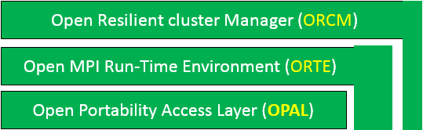

ORCM (Open Resilient Cluster Manager) is a derivative from Open MPI implementation. ORCM framework consists of the following:

1. **ORCM**: Open Resilient Cluster Manager. Provides the following: Resource Management, Scheduler, Job launcher and Resource Monitoring subsystem.
2. **ORTE**: The Open Run-Time Environment (support for different back-end run-time systems). Provides the RM messaging interface, RM error management subsystem, RM routing subsystem and RM resource allocation subsystem.
3. **OPAL**: The Open Portable Access Layer (utility and "glue" code used by ORCM and ORTE). Provides operating system interfaces.

There are strict abstraction barriers in the code between these sections. That is, they are compiled into three separate libraries: liborcm, liborte, and libopal with a strict dependency order: ORCM depends on ORTE and OPAL, and ORTE depends on OPAL.

As such, this code organization more reflects abstractions and software engineering, not a strict hierarchy of functions that must be traversed in order to reach lower layer. For example, ORCM can call OPAL functions directly -- it does not have to go through ORTE. Indeed, OPAL has a different set of purposes than ORTE, so it wouldn't even make sense to channel all OPAL access through ORTE. ORCM can also directly call the operating system as necessary.

Here's a list of terms that are frequently used in discussions about the Open MPI code base:

The Modular Component Architecture (MCA) is the foundation upon which the entire Open MPI project is built. It provides all the component architecture services that the rest of the system uses. Although it is the fundamental heart of the system, it's implementation is actually quite small and lightweight -- it is nothing like CORBA, COM, JINI, or many other well-known component architectures. It was designed for HPC -- meaning that it is small, fast, and reasonably efficient -- and therefore offers few services other finding, loading, and unloading components.

1. **Framework**: An MCA framework is a construct that is created for a single, targeted purpose. It provides a public interface that can be used external to framework, but it also provides its own internal services. An MCA framework uses the MCA's services to find and load components at run time -- implementations of the framework's interface. An easy example framework to discuss is the MPI framework named "btl", or the Byte Transfer Layer. It is used to sends and receive data on different kinds of networks. Hence, Open MPI has btl components for shared memory, TCP, Infiniband, Myrinetc, etc.

**ORCM frameworks**

* analytics: Data reduction using user defined workflow
* cfgi: cluster configuration management
* db: Database system
* diag: System Diagnotics
* pvsn: Provisioning system
* scd: Job Scheduler
* Sensor: Sensor data monitoring subsystem
* sst: cluster subsystem initialization

**ORTE frameworks**

* dfs: Daemon file system operations
* errmgr: Error manager
* ess: Environment specific service
* IOf: I/O forwarding
* filem: Remote file management
* grpcomm: Group communications
* oob: Out-of-band communication
* odls: Daemons local launch subsystem
* plm: Process launch management
* ras: Resource allocation subsystem
* rmaps: Resource mapping subsystem
* routed: Routing table for runtime messaging layer
* rml: Runtime messaging layer (routing of OOB messages)
* rtc: Runtime control 
* state: State machine
* snapc: Snapshot coordination interface
* sstore: Distributed stable storage

**OPAL frameworks**

* allocator: allocate memory
* backtrace: back trace
* btl: Byte transfer layer
* compress: compression framework
* crs: checkpoint and restart
* dstore: database framework for internal storage
* event: event handler
* hwloc: Hardware locality
* if: net if
* installdirs: opal build prefix for install folders
* memchecker: Memory checker
* memcpy: memory copy
* memory: memory hooks
* mpool: memory pool
* pstat: process status
* rcache: Registration cache framework
* shmem: shared memory backing facility
* timer: High-resolution timers
* sec: security authentication/authorization

2. **Component**: An MCA component is an implementation of a framework's interface. Another common word for component is "plugin". It is a standalone collection of code that can be bundled into a plugin that can be inserted into the Open MPI code base, either at run-time and/or compile-time.

3. **Module**: An MCA module is an instance of a component (in the Object Oriented Programming (OOP) sense of the word "instance"; an MCA component is analogous to a “class”). For example, if a node running an Open MPI application has multiple Ethernet NICs, the Open MPI application will contain one TCP btl component, but two TCP btl modules. This difference between components and modules is important becaue modules have private state; components do not.

Components can be dynamic or static, that is, they can be available as plugins or they may be compiled statically into libraries (e.g., liborcm).
