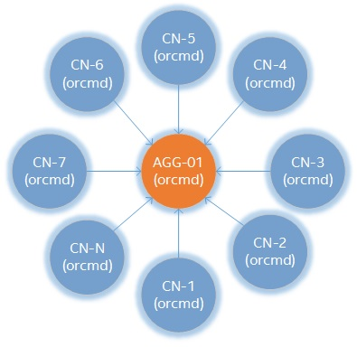
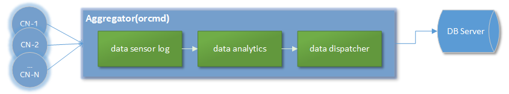

# Getting Started <br/>

Sensys provides resilient and scalable monitoring for resource utilization and state of node health, collecting all the data in a database for subsequent analysis. Sensys includes several loadable plugins that monitor various metrics related to different features present in each node like temperature, voltage, power usage, memory, disk and process information.

# Requirements<br/>

## Operating Systems
* CentOS 7.3
* SLES 12 SP2


## Dependencies

Name | Version
----|----
Sigar |	1.6.5
libesmtp |	1.0.6
net-snmp |	5.7.3
net-snmp-devel |	5.7.3
ipmiutil |	2.9.6
ipmiutil-devel |	2.9.6
postgresql |	9.3
postgresql-devel |	9.3
numactl-libs |	2.0.9
openssl |	1.0.1
zeromq |	4.0.5

The dependencies above are needed in order to build Sensys with full support. For more information visit [Build dependencies](2-Build-and-Installation-Guide/2.1-Sensys-Build-and-Installation/2.1.01-Build-Dependencies.html).
# Download and Installation <br/>

## Installing Sensys
### Download desired RPMs [CentOS|SLES]

Sensys RPMs can be downloaded from:
```
https://github.com/intel-ctrlsys/sensys/releases
```

### Install on CentOS

After Downloading RPMs, install them using yum:
```
# yum install -y sensys-x-y-z.x86_64.rpm \
sensys-common-x-y-z.x86_64.rpm
```
Where x,y,z = version
### Install on SLES
After Downloading RPMs, install them using zypper:
```
# zypper install sensys-x-y-z.x86_64.rpm \
sensys-common-x-y-z.x86_64.rpm
```
Where x,y,z = version
### Source Code
Alternatively, Sensys source code can be obtained by cloning the repo as shown below:
```
$ git clone https://github.com/intel-ctrlsys/sensys.git
```
Once the source is downloaded, just compile and install as follows:
```
$ ./autogen.pl
$ ./configure --prefix=/opt/sensys --with-platform=contrib/platform/intel/hillsboro/orcm-nightly-build
$ make
# make install
```
Default installation path is `/opt/sensys` but you can modify it on `--prefix=<path>`
# Configure and run a sensor <br/>
Once installed, Sensys binaries can be found on `/opt/sensys/bin` (on source builds, installation path was specified using --prefix parameter)

The following sections show how to execute Sensys coretemp and freq sensors. For more information visit [RAS Monitoring](3-Sensys-User-Guide/3.8-RAS-Monitoring.md).


### Core-Frequency test

The example below shows how to start monitoring core frequency using Sensys:
```
# orcmd --omca sensor heartbeat,freq \
-omca sensor_base_sample_rate 1 \
-omca db print
```

### Core-Temp test

The example below shows how to start monitoring core temperature using Sensys:
```
# orcmd -omca sensor heartbeat,coretemp \
-omca sensor_base_sample_rate 1 \
-omca db print
```
### MCA Parameters

The set of parameters in the examples above mean:

**orcmd**  `[--omca sensor <sensora>,<sensorb>] [--omca sensor_base_sample_rate <t>] [--omca db print]`
* -omca sensor <sensora>,<sensorb>: Here you shall specify the sensor you want to sample
* -omca sensor_base_sample_rate <t>: Here you shall specify time between samplings, measured in seconds (default sample rate is 300)
* -omca db print: This print sensor sampling on screen terminal

For more details visit [MCA Parameters](2-Build-and-Installation-Guide/2.1-Sensys-Build-and-Installation/2.1.11-Setting-MCA-Parameters.md) and more information about **orcmd** sensors at [orcmd](3-Sensys-User-Guide/3.2-orcmd.html)


# Link metrics to database <br/>

In order to run all Sensys features properly, you have to install and configure postgresSQL as follows:


### Install postgresql on CentOS

```
# yum install -y postgresql
```

### Install postgresql on SLES

```
# zipper install -y postgresql
```

## Postgresql post-install configuration

After installing postgres run these commands as follows:

### Setting up database:

```
$ sudo –u postgres createuser –P orcmuser
$ sudo -u postgres createdb --owner orcmuser orcmdb
```

## Database schema installation

Sensys is distributed with a SQL script for the setup of the database schema. A file `sensys-schema.sql` can be found under `contrib/database` folder in the **source code of Sensys** or `/opt/sensys/share/db-schema/` if you are **installing from rpm**.

```
$ psql -U orcmuser -W -f sensys-schema.sql orcmdb
```

## Sensys sensor with database storage feature

The example below shows how to start monitoring frequency and storing its output into the database at same time.

```
# orcmd -omca sensor heartbeat,coretemp \
-omca sensor_base_sample_rate 1 \
-omca db_postgres_uri localhost:5432 \
-omca db_postgres_user orcmuser:orcmpassword \
-omca db_postgres_database orcmdb
```

Notice that there are a few new parameters here:
* -omca db_postgres_uri <hostname>:<port>: Here you shall specify the host name and port of database configuration
* -omca db_postgres_user <user>:<password>:  Here you shall specify user and password of database role
* -omca db_postgres_database <database_name>: Here you shall specify database name.


## Querying Stored Data

As we mentioned above by enabling Sensys database feature it allows storing sampling data into configured database.

If you want to check if everything works out well you have to log in as follows:

```
$ psql -d <database_name> -U <database_user>
```

If you used the configuration above in `Database schema installation` section just run as follows:

```
$ psql -d orcmdb -U orcmuser
```

Once logged in you can use SQL statements to check any available table. As an example:

```
$ SELECT * FROM data_sample_raw;
```

The query above must show sampling data of the **orcmd** as shows:


 hostname | dataitem | time_stamp | valueint  | valuereal | valuestr |  units    | datatypeid | appvaluetypeid | eventid | datasampleid
 --------- | ----------- | ------------ | ------------ | ------------ | ----------- | ----------- | -------------- | ------------------- | ---------- | ----------------
localhost | coretemp_storage_type | 2017-07-03 10:17:58 |         0 |            |           |           |           11 |                11 |    19155 |          74566
 localhost | coretemp_core0        | 2017-07-03 10:17:58 |           |         29 |           | degrees C |           16 |                16 |    19155 |          74567
 localhost | coretemp_core1        | 2017-07-03 10:17:58 |           |         35 |           | degrees C |           16 |                16 |    19155 |          74568
 localhost | coretemp_core2        | 2017-07-03 10:17:58 |           |         26 |           | degrees C |           16 |                16 |    19155 |          74569
 localhost | coretemp_core3        | 2017-07-03 10:17:58 |           |         29 |           | degrees C |           16 |                16 |    19155 |          74570
 localhost | coretemp_core4        | 2017-07-03 10:17:58 |           |         33 |           | degrees C |           16 |                16 |    19155 |          74571
 localhost | freq_storage_type     | 2017-07-03 10:17:58 |         0 |            |           |           |           11 |                11 |    19156 |          74579
 localhost | freq_core0            | 2017-07-03 10:17:58 |           |      1.596 |           | GHz       |           16 |                16 |    19156 |          74580
 localhost | freq_core1            | 2017-07-03 10:17:58 |           |      1.596 |           | GHz       |           16 |                16 |    19156 |          74581
 localhost | freq_core2            | 2017-07-03 10:17:58 |           |      1.596 |           | GHz       |           16 |                16 |    19156 |          74582
 localhost | freq_core3            | 2017-07-03 10:17:58 |           |      1.596 |           | GHz       |           16 |                16 |    19156 |          74583
 localhost | freq_core4            | 2017-07-03 10:17:58 |           |      1.596 |           | GHz       |           16 |                16 |    19156 |          74584


The table above was a result from coretemp and freq sensor.

# Aggregator node and multi-node execution

Sensys has a daemon called `orcmd` that runs at root level. This daemon is able to perform two different types of roles: the aggregator and the compute node.



Sensys architecture allows you to connect multiple nodes to a single aggregator.

## Aggregator

An aggregator is an interface that receives all the telemetry collected by a single or multiple nodes in a cluster. This role's responsbility is to provide a data analytics for the incoming telemetry to dispatch data to a database.



The aggregator and the compute node roles are given by the user. Those are specified on the configuration file named `orcm-site.xml`. The example below is the most basic configuration having an aggregator node `agg01` and a compute node `cn02`.

```xml
<?xml version="1.0" encoding="UTF-8" ?>
<configuration>
    <version>3.1</version>
    <role>RECORD</role>
    <junction>
        <type>cluster</type>
        <name>My_cluster</name>
        <junction>
            <type>row</type>
            <name>My_row</name>
            <junction>
                <type>rack</type>
                <name>agg01</name>
                <controller>
                     <host>agg01</host>
                     <port>55805</port>
                     <aggregator>yes</aggregator>
                </controller>
                <junction>
                     <type>node</type>
                     <name>cn01</name>
                </junction>
            </junction>
        </junction>
    </junction>

    <scheduler>
        <shost>SMS</shost>
        <port>55820</port>
    </scheduler>
<configuration>
```

## Scheduler

The `orcmshed` is another Sensys daemon run at root level. The main purpose of the daemon is to keep the status of each of the `orcmd` it also acts as a communication gateway between them. For further details please take a look at our wiki section [3.3 orcmsched](3.3-orcmsched)

## Sensys configuration

The previous configuration file shown has a hierarchy-based cluster architecture which presents the interconnection between aggregator node and compute node. Sensys allows multiple aggregator and compute node configuration by simply adding junction type `rack` to describe the aggregator-node connectivity, ie:

```XML
<junction>
    <type>rack</type>
    <name>agg02</name>
    <controller>
         <host>agg02</host>
         <port>55805</port>
         <aggregator>yes</aggregator>
    </controller>
    <junction>
        <type>node</type>
        <name>cn[2:00-49]</name>
        <controller>
            <host>@</host>
            <port>55805</port>
            <aggregator>no</aggregator>
        </controller>
    </junction>
</junction>

```
Above configuration specifies the connection between an aggregator called `agg02` and fifty compute nodes name as cnXX starting from `cn00` to `cn49`. The configuration file makes use of regular expressions to configure multiple compute nodes with a single junction node description. The special character `@` parameter in the `host` tag is used to indicate that the `name` tag value of the parent junction will be used to replace the character.

As mentioned on the previous section, `orcmd` can be configured using mca parameters. As the `orcmd` parameter list increases it also becomes difficult to handle it on a one-liner command. Therefore Sensys offers two solutions:

1. Include a mca parameter list on the orcm-site.xml configuration file as follows:

```XML
<mca-params>sensor_sample_rate=10,sensor_base_verbose=100</mca-params>
```
This options is recommended when you want to have a dedicated configuration for certain nodes or aggregators. This tag can be used inside the `scheduler` and `controller` tags.

2. Use an specific configuration file located and named as `<sensys_installation_path>/etc/openmpi-mca-params.conf`

```
sensor_sample_rate=10
sensor_base_verbose=100
```
This option is recommended to create a default configuration that applies to all the nodes in the system.

# Advanced features
## Data analytics

The data analytics is a framework that provides data processing through plug-ins that performs different data analysis like: data filtering, average, threshold among others. This service can be requested and configured using workflows. For specific details of the available plug-ins, scope and usage please refer to our wiki section [3.9 Data Smoothing Algorithms Analytics](3.9-Data-Smoothing-Algorithms-Analytics).

## Notification events

The notification event provides information for system events or errors. Sensys provides two notification mechanisms through plug-ins: smtp and syslog. Notification events are requested using workflows. For further details please visit section [3.10 ErrorManager Notification](3.10-ErrorManager-Notification).

The example below shows a threshold data analytics with a notification event using syslog:

```XML
<?xml version="1.0" encoding="UTF-8" standalone="no" ?>
<workflows>
    <aggregator>aggregator1</aggregator>
    <workflow name = "wf1">
         <step name = "filter">
             <hostname>c[2:00-10]</hostname>
             <data_group>coretemp</data_group>
             <core>core0</core>
             <notifier_action>syslog</notifier_action>
        </step>
    </workflow>
</workflows>
```
